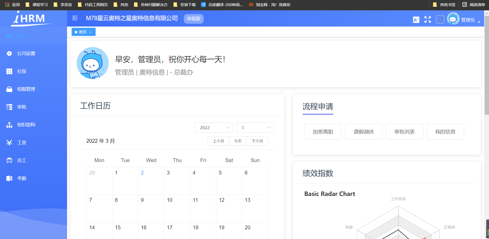
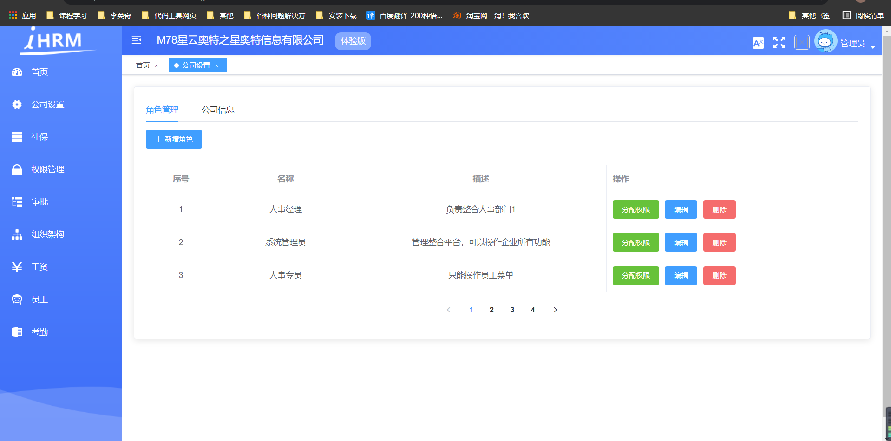
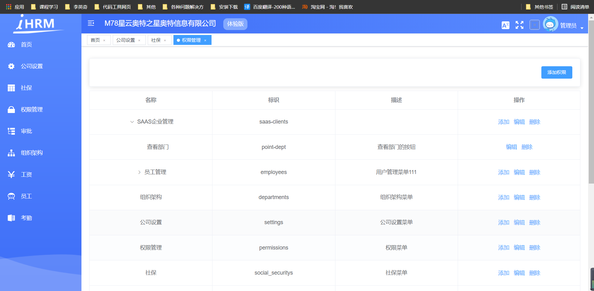
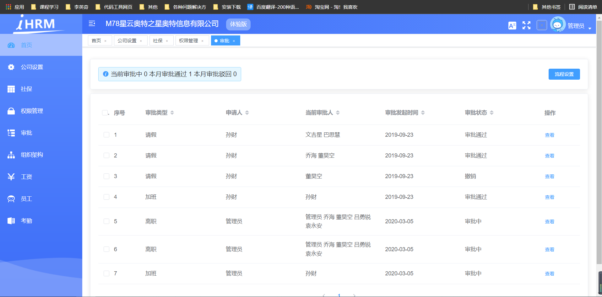
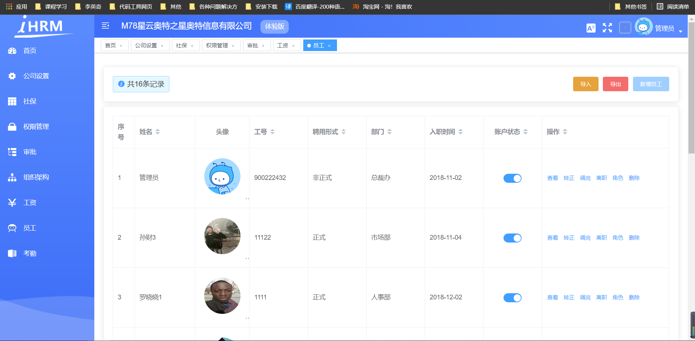
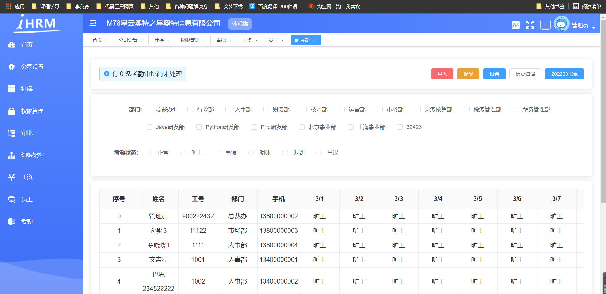

联系方式 QQ：550798972

### 一 项目心得

  项目采用vue-admin-template二次开发，主要用于人力资源相关流程的信息管理（类似于OA–办公自动化）员工管理；角色管理；权限管理；授权流程分析；组织架构等… 

 

### 二 主要功能

  功能包括：员工事务审批，员工考勤管理，公司设置，组织架构管理，员工管理，**基于角色的权限控制管理**，腾讯云对象存储，excel导入员工信息，打印员工个人资料，多语言切换，主题切换，多tab页等功能。

### 三 项目部分界面预览

1 首页

2 公司设置

3 权限管理

4 审批

5 员工

6 考勤

## ☆网创项目介绍

  感谢您的关注与支持，相信您也是和大家一样有点空闲的时间，想做点副业赚点钱。大家可能在许多自媒体平台也看到，现在也有非常多的项目赛道，比如`图文带货`、`小说推广`、`影视剪辑`、`直播切片`、`无人直播`、`亚马逊电商`等等非常多的变现项目。

  您可能之前也尝试过去学习一下这些项目，有些博主收徒什么的，费用一般至少400起步，才教您怎么去做。可能您也尝试过一两个，交了上千的学费，但是最终没有做起来。

别的地方买800，900上千，我们平台统一价格**20￥**，平台内还有许多其他教程，想要做这些项目的，想要购买教程的，可以扫这个二维码进入商城购买。

【腾讯文档】网创项目介绍F.pdf
https://docs.qq.com/pdf/DTnBCU2RaZWNpVFRY

**联系方式微信**：**xl110387**

